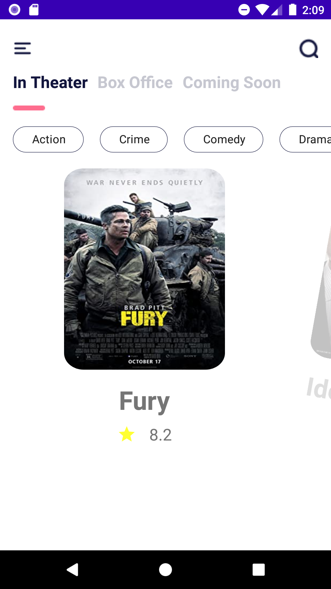
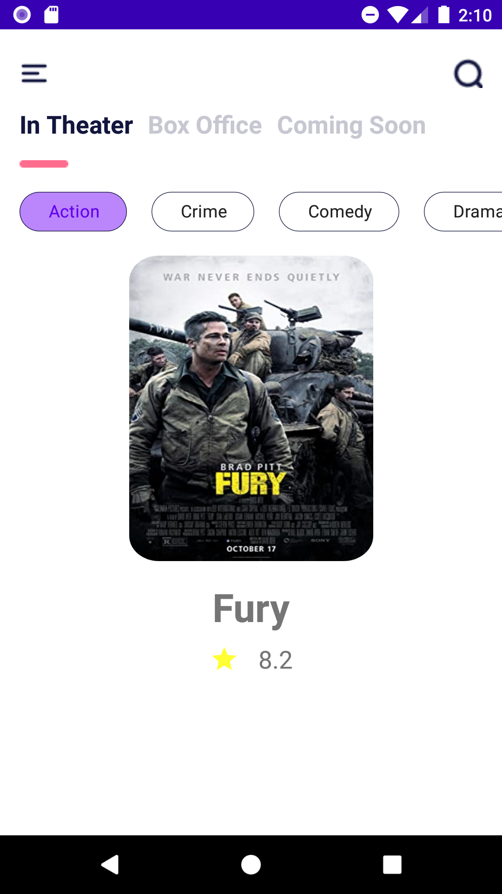
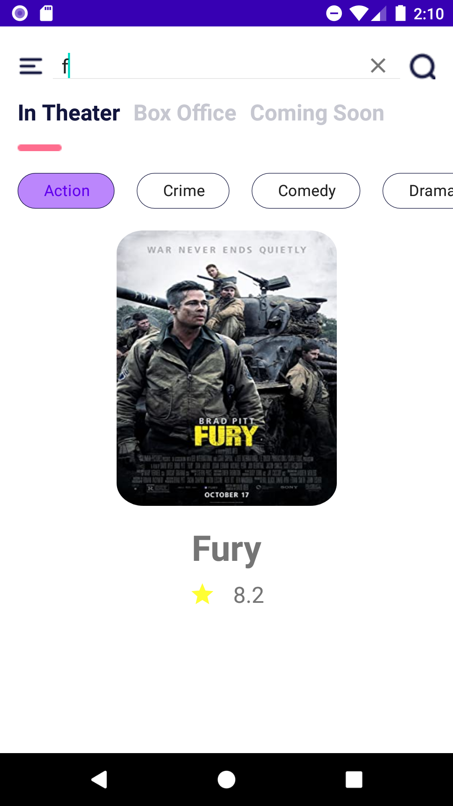
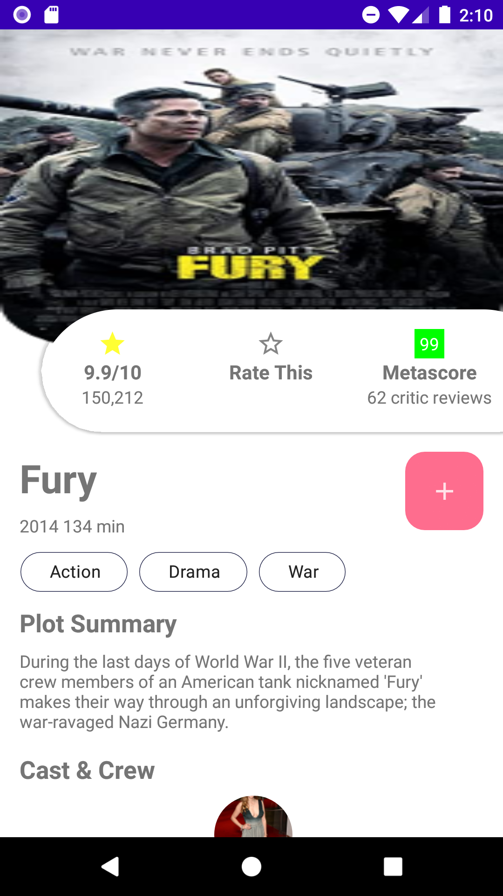
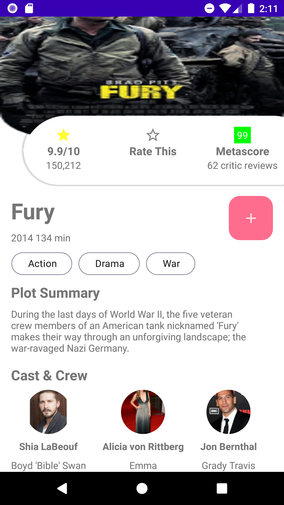

# Movie-App-Kotlin-XML
Basic Movie App implemented with Kotlin XML.

# Features
- Search by movie name
- Search by genre
- Save movie to watch list or remove movie from watch list
- Refresh by swipe up
- Filter movies by type

# Screenshots

# UI Kit Source
https://dribbble.com/shots/10795979-Movie-App-Free
